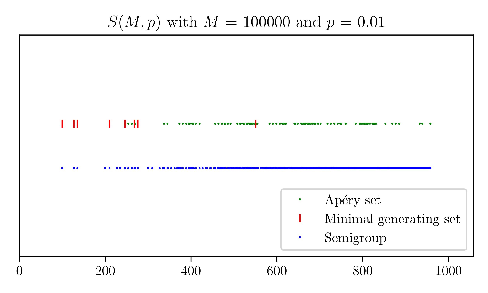

# smgps

Random numerical semigroup experiments for my [Graduation Project](https://github.com/smoralesduarte/GraduationProject). The methodology is explained in the [final document](https://github.com/smoralesduarte/GraduationProject/blob/main/thesis.pdf). Sample ER-type random numerical semigroup: 

